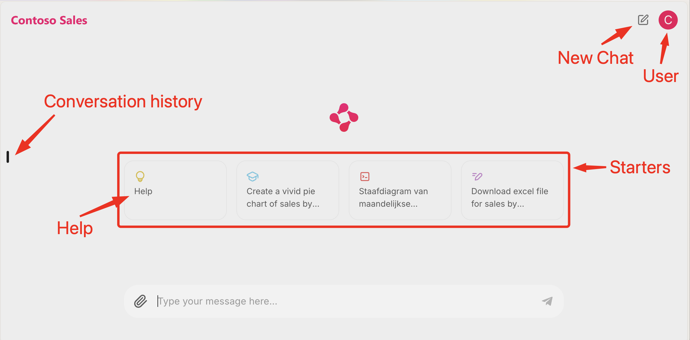
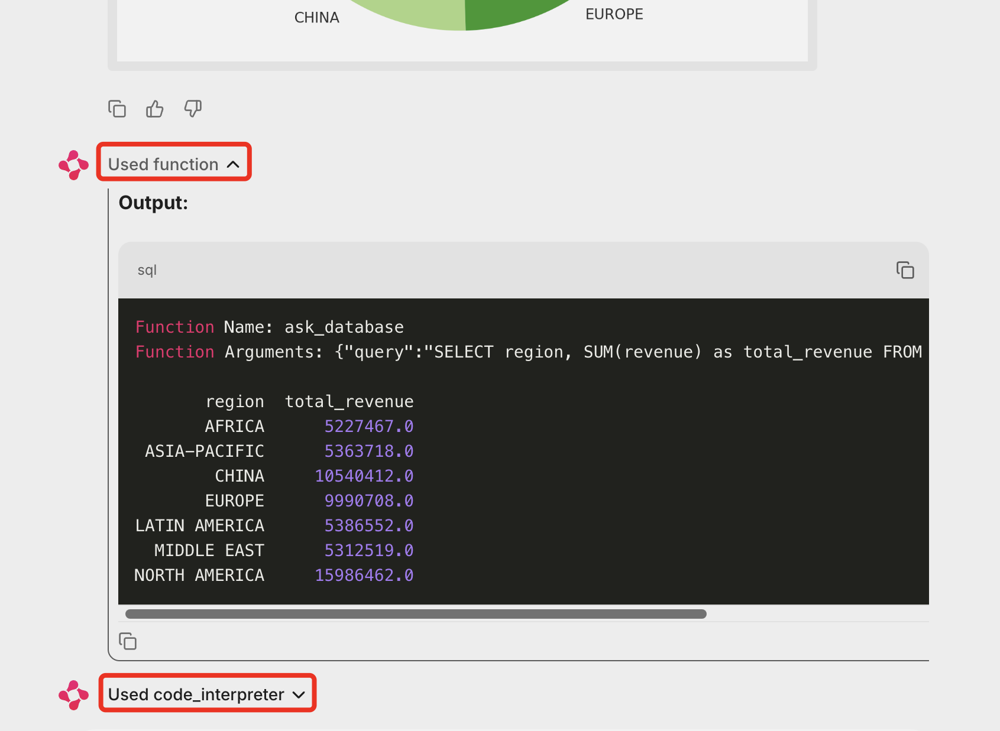
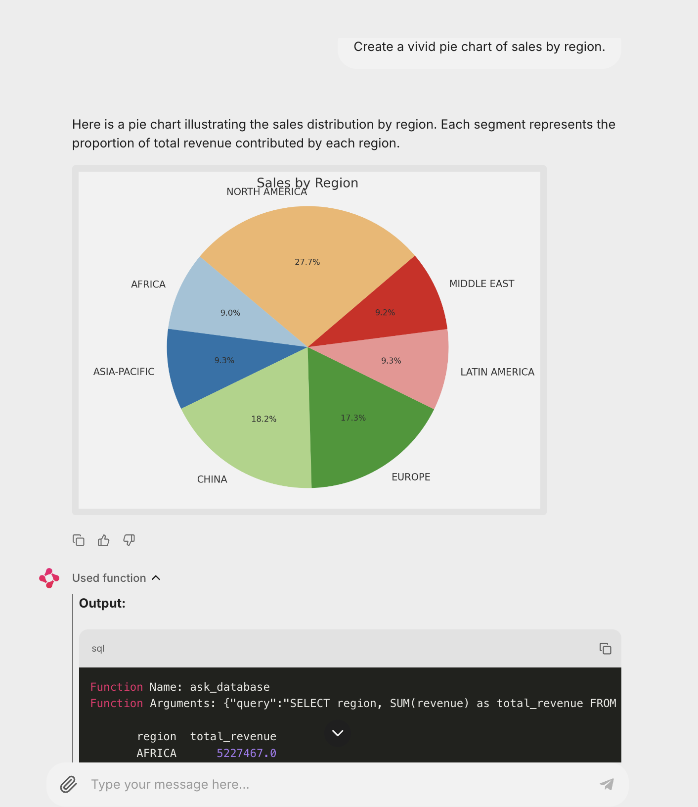

# Get Started

1. Below is the demo script used in the video, but since the application is powered by a large language model (LLM), conversations will vary. **Be prepared to adapt based on the responses you receive.**

      The script is a guide rather than a strict rule. **However, be aware that some prompts may produce large amounts of data, which can be tedious for the audience as it streams to the assistant. To maintain engagement**. It's best to use prompts that generate concise responses. The assistant instructions favour data aggregates to reduce data returned from the database.

2. The chat window shows the LLM [Chain of Thought](https://en.wikipedia.org/wiki/Prompt_engineering#Chain-of-thought), this is enabled to help understand the context of the conversation. **You can show the SQL queries and results from the "Function Calling" tool, and the Python code generated by the "Code Interpreter" tool by clicking their associated dropdowns.** Note, there is an overhead to "Chain of Thought" as the context needs to be streamed to the chat window. In production, you would turn "Chain of Thought" off.
3. The Code Interpreter performance execution times can vary a lot, this is dependent on the code complexity, location, and time of day, so be patient when waiting for the Python code to execute and have talking points ready to fill the time.

## The Demo Script

1. From your browser, navigate to the [Contoso Sales Assistant](https://aka.ms/contoso-sales-assistant) website.
2. Login with your GitHub account to get a demo key.
3. Follow the instructions for the event, copy your API Key and navigate API Assistant demo.

### Set the Assistant UX to Light Mode

Suggest setting light mode as generally better for an audience.

1. From the top right, select user icon
1. Select Light Mode
1. Start with chat history closed

### Start the conversation

There are prompt starters in the chat window. The user can select these to start the conversation.

1. Select **Help**.

      This will provide a list of sample questions that the assistant can answer. Remember, on startup, the assistant loaded the database schema, product categories, product types, and reporting years, so it has this context to work with when providing help.

1. Type **Help (in your preferred language)**. For example, Help in Dutch, Help in French, etc. This will provide a list of sample questions that the assistant can answer in the selected language.
1. You can demo in your preferred language but be sure to test the language support first.
1. Select **Start new chart**.
1. Select the 2nd from left starter.

      **Create a vivid pie chart of sales by region.**

      The LLM will generate a SQL query, next the LLM will call the **ask_database** function to execute the query and return the results. The LLM will then generate the Python code to create the pie chart. You can expand the "Chain of Thought" to see the SQL query and the results, and the Python code to create the pie chart executed by the Code Interpreter.

      

1. Next, we'll ask about beginner-friendly tents. The sales database has limited knowledge of the products as the focus of the database is sales data, so the LLM will generate a **limited** response based on the data available.

   **What beginner-friendly tents does Contoso sell?**

1. Next, we'll going to upload a Contoso Tents Datasheet to the Assistants API. This will allow the assistant to provide more detailed information about the tents. The Assistants API will vectorize the PDF and store the data in a vector store and the LLM will be able to access the data using hybrid (semantic and keyword) queries.

   1. Drag and drop the **contoso-tents-datasheet.pdf** onto the Contoso Sales Assistant. The assistant will now have access to the tent data. The pdf is in the **datasheet** folder for **demo-1** of this repository.
   2. Add the prompt **What beginner-friendly tents does Contoso sell?**
   3. Add resubmit the question.

   Now the assistant has access to the tent data and can provide more detailed information.

1. Now, we're going to combine the data from the sales database and the tent datasheet to provide a more detailed analysis.

   Submit the following prompt: **Show sales of tents by region and include a brief description in the table about each tent.**

1. Finally, let's use the Assistants API and the code interpreter to generate a report on the sales of beginner-friendly tents in Excel format.

   Submit the following prompt: **Create an excel file**

   The LLM will generate the Python code to create the Excel file. You can download the file by selecting the download link and open in Excel.

## Other questions to ask

1. **What are the top 5 products by sales?**
2. **Sales by region?**
3. **Sales by category?**
4. **What are the top 5 products by sales for travel?**
