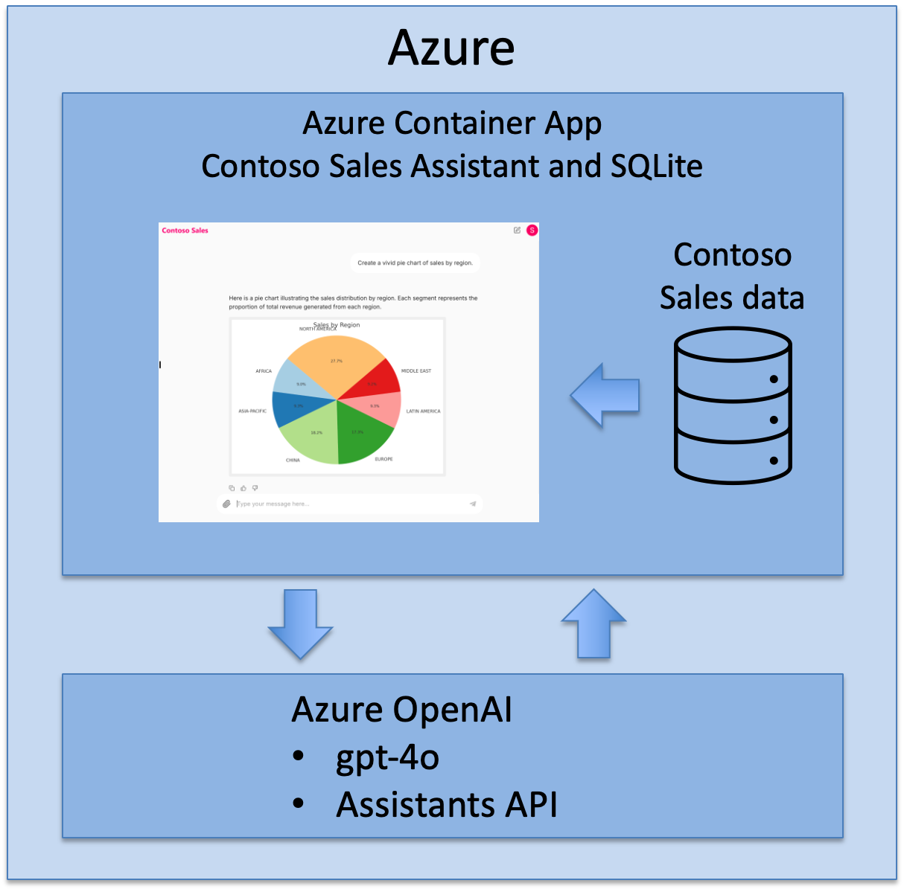

# Contoso Sales Assistant

## Introduction to the Contoso Sales Assistant

You are a sales manager at Contoso, a multinational retail company that sells outdoor equipment. You need to analyze sales data to find trends, understand customer preferences, and make informed business decisions. To help you, Contoso has developed a conversational assistant that can answer questions about your sales data.

## Solution Overview

The Contoso Sales Assistant is a conversational agent that can answer questions about sales data, generate charts, and create Excel files for further analysis.

The app is built with [Azure OpenAI GPT-4o](https://learn.microsoft.com/azure/ai-services/openai/concepts/models){:target="_blank"} , the [Azure OpenAI Assistants API](https://learn.microsoft.com/azure/ai-services/openai/concepts/assistants){:target="_blank"}  and the [Chainlit](https://docs.chainlit.io/){:target="_blank"}  Conversational AI  web framework.

The app uses a read-only SQLite Contoso Sales Database with 40,000 rows of synthetic data. When the app starts, it reads the sales database schema, product categories, product types, and reporting years, then adds this info to the Azure OpenAI Assistants API instruction context.

The Contoso Sales Assistant app is deployed to Azure using Azure Container Apps. The app is fully asynchronous, uses the FastAPI framework, and streams all responses to users in real-time.

<!-- The Contoso Sales Assistant integrates Azure OpenAI Assistants API with Chainlit to deliver a streamlined conversational experience. The Azure OpenAI Assistants API manages conversation flow, orchestrates tools, and generates responses, while Chainlit provides the conversational web interface for users. The LLM generates SQL queries, Python code, and other responses based on user input, and the app uses the Azure OpenAI Assistants API to execute these tasks. -->

## Azure OpenAI Assistants API as an Orchestrator

The OpenAI Assistants API acts as an orchestrator, managing multiple tools and functions based on user input. Using parameters like tool_choice, it directs tasks to the right tools seamlessly within a single request, maintaining context across workflows. This orchestration reduces backend complexity, allowing developers to focus on core functionality while the API dynamically handles multi-tool automation, making it ideal for sophisticated applications.

## Why use the Azure OpenAI Assistants API?

The Azure OpenAI Assistants API makes it easier to build Generative AI apps by simplifying key tasks:

1. **Stateful**: builtin conversation state management.
2. **Reduced development effort**: Abstracts the complexities of integrating AI allowing developers to focus on building features rather than managing the AI model interaction.
3. **Context Management**: The API automatically handles conversation context, ensuring the AI provides relevant, coherent responses throughout interactions.
4. **Powerful native tools and 3rd Party extensibility**: Access up to 128 tools in parallel including functions, code interpreter, and file search.
5. **Scalability**: It scales effortlessly, managing workloads and resources automatically to handle both small and large user bases.
6. **Context Execution**: The API lets you define and run context against an LLM, making it easier to perform tasks like data queries or code generation based on specific instructions.

The following table compares the Azure OpenAI Assistants API with the Chat Completions API.

| Chat Completions API              | Assistants API                               |
|----------------------------------|----------------------------------------------|
| Stateless            | Stateful with persistant threads                                     |
| Lightweight and powerful            | Automatic context management                |
| Action Tools - Function calling                | Multiple tools in parallel                  |
|                                   | Action Tools - Code Interpreter - Function calling                                 |
|                                   | Knowledge tools - File Search in multiple formats                              |

## Assistants components

For more information on the components of the Azure OpenAI Assistants API, see the [Azure OpenAI Assistants API documentation](https://learn.microsoft.com/azure/ai-services/openai/concepts/assistants){:target="_blank"}.

| Component | Description |
|-----------|-------------|
| **Assistant** | Custom AI that uses Azure OpenAI models in conjunction with tools. |
| **Thread** | A conversation session between an Assistant and a user. Threads store Messages and automatically handle truncation to fit content into a model's context. |
| **Message** | A message created by an Assistant or a user. Messages can include text, images, and other files. Messages are stored as a list on the Thread. |
| **Run** | Activation of an Assistant to begin running based on the contents of the Thread. The Assistant uses its configuration and the Thread’s Messages to perform tasks by calling models and tools. As part of a Run, the Assistant appends Messages to the Thread. |
| **Run Step** | A detailed list of steps the Assistant took as part of a Run. An Assistant can call tools or create Messages during its run. Examining Run Steps allows you to understand how the Assistant is getting to its final results. |

### OpenAI Tools

The app uses the following Azure OpenAI tools:

1. **[Function Calling](https://learn.microsoft.com/azure/ai-services/openai/how-to/function-calling){:target="_blank"}**: To execute LLM generated SQL queries against the read-only SQLite database.
2. **[Code Interpreter](https://learn.microsoft.com/azure/ai-services/openai/how-to/code-interpreter?tabs=python){:target="_blank"}**: To run Python code to create visualizations like pie charts and bar charts, and generate Excel files for users to download for deeper analysis.
3. **[File Search](https://learn.microsoft.com/azure/ai-services/openai/how-to/file-search?tabs=python){:target="_blank"}**: To extend the assistant's knowledge with user loaded Contoso product datasheets.

### Best Practices

The app demonstrates best practices for creating a conversational agent with the Azure OpenAI Assistants API. The app is fully asynchronous, uses the FastAPI framework, and streams all responses to users in real-time.

### Extending

This solution can be easily adapted to support other scenarios, such as customer support, simply by changing the database and adjusting the Azure OpenAI Assistants API instructions to fit the new use case.

## The Contoso Sales Assistant Source Code

The source code is available in the [Contoso Sales Assistant built with the Azure OpenAI Assistant API and Chainlit](https://github.com/gloveboxes/contoso-sales-azure-openai-assistant){:target="_blank"}  repository.
